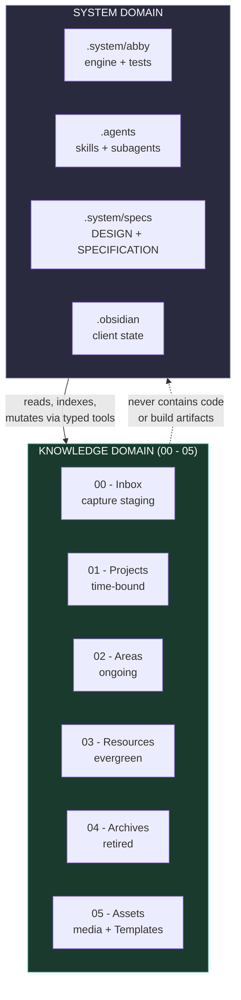
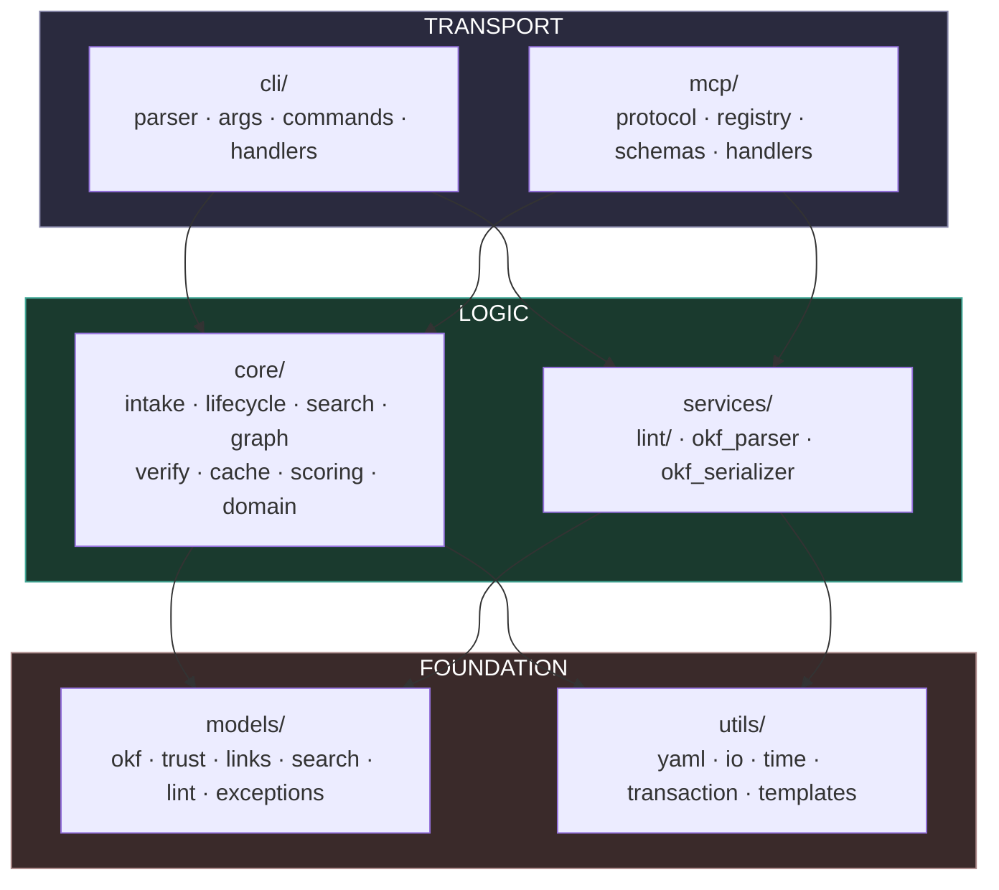
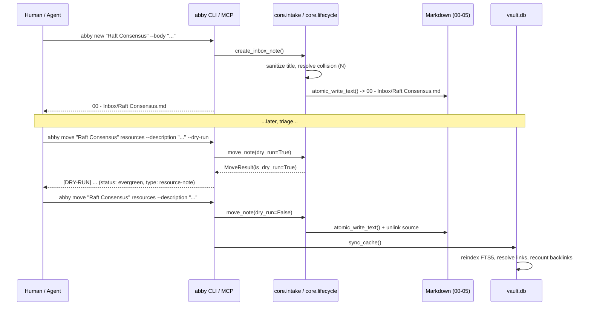
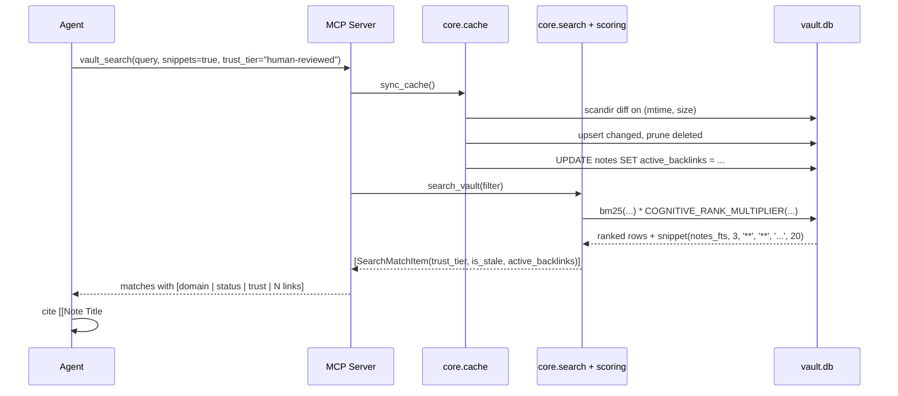
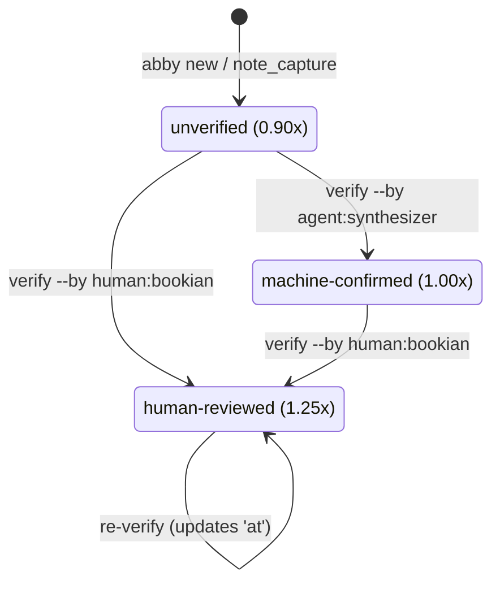
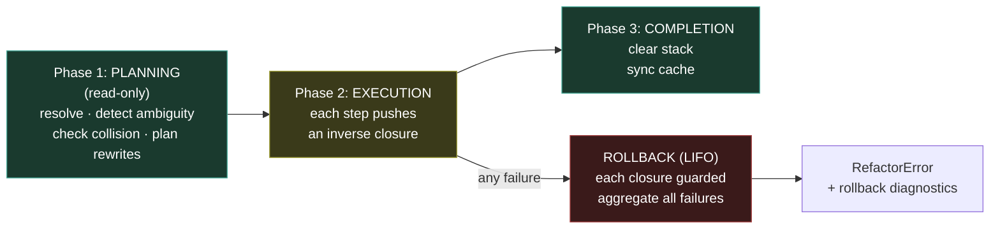
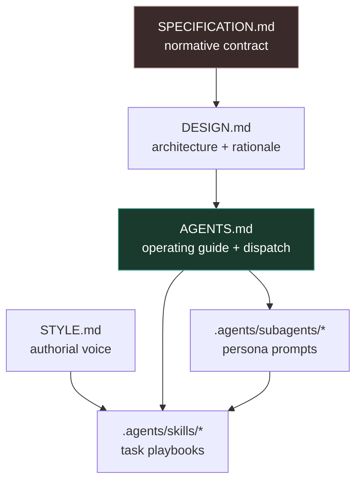
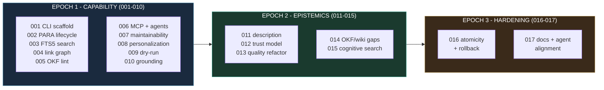

# Abby Knowledge Vault — System Design

Why the Abby Knowledge Vault is built the way it is. Distilled from the 17 engineering epochs (`001`–`017`) and the architectural invariants in [`SPECIFICATION.md`](SPECIFICATION.md).

> [!NOTE]
> **Companion document**: [`SPECIFICATION.md`](SPECIFICATION.md) states *what* the system must do (schemas, signatures, exit codes, invariants). This document explains *why* — the architectural forces, the patterns chosen, the alternatives considered and rejected, and the tensions left open.

---

## 1. Problem Statement

A knowledge vault that serves two audiences with incompatible failure modes.

**Humans** edit Markdown in Obsidian. They need files that stay readable, links that keep working, formatting that survives round-trips, and no tool that silently rewrites their prose. Their failure mode is **corruption** — a script that reflows YAML, strips a `^blockid`, or truncates a file mid-write.

**AI agents** retrieve and synthesize at machine speed. They need structured metadata, sub-25 ms search, deterministic tool interfaces, and explicit signals about what is trustworthy. Their failure mode is **hallucination** — confidently asserting something the vault never said, or citing a stale draft as settled fact.

Abby's entire design is a set of answers to one question: *how do you serve both without the tooling for one becoming the hazard for the other?*

Three commitments follow, and almost everything else is downstream of them:

1. **Flat Markdown is the only source of truth.** Every index, cache, and graph is derived and disposable.
2. **The system never guesses about trust.** Epistemic authority is computed from provenance, never asserted.
3. **Automation is reversible by construction.** Preview before mutation, atomic writes, transactional rollback.

---

## 2. Constitutional Foundation

Six principles govern every design decision. They are ratified policy, not guidance.

| # | Principle | Practical consequence |
|---|---|---|
| **I** | Dual-Audience Architecture & OKF | Notes are simultaneously an Obsidian document and a typed record. Handover context is mandatory at every human↔AI transition |
| **II** | Strict Boundary Separation | `00`–`05` hold content only; `.system/` holds code only. Non-negotiable, bidirectional |
| **III** | Self-Contained Technical Artifacts | Zero undeclared dependencies, clear CLI contracts, deterministic execution, targeted dry-run mandate |
| **IV** | Antigravity & Agent-First Orchestration | `AGENTS.md` is the authoritative agent prompt; `.agents/` holds skills and subagents |
| **V** | Curated Knowledge Lifecycle (PARA+) | Every note has an explicit lifecycle state. No unclassified drift |
| **VI** | Verifiable Quality & Testing Discipline | Three-tier tests, full exit-code matrices, sandbox isolation, negative-path coverage |

Amendments require explicit proposal, rationale review, and a semantic version bump. The constitution's own versioning policy reserves MAJOR bumps for taxonomy changes and domain boundary redefinition — which is why the PARA+ folder names have never moved across 17 features.

---

## 3. The Air-Gap Architecture

The central structural idea: two domains that share a repository but never share write access.



**Why this matters more than it looks.** The boundary is what makes the vault safely agent-operable. Because the engine can never be *in* the knowledge domain, a knowledge-editing agent physically cannot corrupt the tooling, and a tooling agent operating under the zero-mutation assertion physically cannot corrupt notes. The guarantee is structural rather than behavioral, so it holds even when an agent misbehaves.

The `.obsidian/` directory is a deliberate third category: human-interface state that agents must not touch unless explicitly tasked with client setup. It is in the System Domain by location but off-limits by policy.

**One documented exception**: `05 - Assets/Templates/` is editable by system agents because templates are empty scaffolding, not human thought. This was contested during feature 017 and resolved by narrowing the zero-mutation assertion from `00`–`05` to `00`–`04` for documentation work specifically. [`SPECIFICATION.md` §13.1](SPECIFICATION.md#131-reconciled-drift) records the reconciliation.

---

## 4. Engine Architecture

### 4.1 Layering

`.system/abby/` — 75 modules, ~6,200 LOC, pure standard library, strictly unidirectional dependencies.



The dependency rule is `models`/`utils` → `core`/`services` → `cli`/`mcp`, with zero cycles and zero deferred imports. This is not a convention — `tests/integration/test_architecture.py` parses the AST of every module and fails the build on violation.

### 4.2 The Layer Purity Rule

> Code in `core/` and `services/` MUST NOT write to stdout/stderr and MUST NOT call `sys.exit()`.

This single rule is what allows one service layer to feed two transports. Logic returns typed results or raises typed exceptions; the CLI layer translates those into exit codes and text, and the MCP layer translates the *same* exceptions into `isError: true` results without killing the server loop. Without it, either the MCP server would print garbage into the JSON-RPC stream, or the two surfaces would drift into separate implementations.

That drift is exactly what feature 006 was designed to prevent: every MCP tool delegates to the identical service function the CLI calls, so CLI/MCP parity is structural rather than tested-into-existence.

### 4.3 Module Map

| Package | Responsibility |
|---|---|
| `models/` | Pure dataclasses: `okf`, `trust`, `links`, `search`, `lint`, `exceptions`, `protocols` |
| `utils/` | `yaml` (escape/unescape/format), `io` (atomic writes), `time`, `transaction` (rollback), `templates` |
| `services/okf_parser`, `okf_serializer` | Frontmatter tokenization and emission, decoupled from the data model |
| `services/lint/` | `scanner` · `rules` · `trust_validators` · `validators` · `remediation` · `reporting` |
| `core/` | `discovery`, `health`, `doctor`, `init`, `intake`, `lifecycle`, `verify`, `domain`, `resolution`, `cache`, `search`, `search_builder`, `scoring` |
| `core/graph/` | `parser` · `cache` · `traversal` · `diagnostics` · `refactor` |
| `cli/` | `parser`, `args/*`, `commands/*`, `handlers` |
| `mcp/` | `protocol`, `server`, `registry`, `schemas`, `handlers/*`, `types`, `tools` (facade) |

---

## 5. Key Design Decisions

Each entry records the choice, the alternatives that were rejected, and the reason.

### 5.1 Zero Third-Party Dependencies

**Chosen**: CPython 3.10+ standard library only — `argparse`, `sqlite3`, `re`, `pathlib`, `dataclasses`, `json`, `tempfile`, `ast`.

**Rejected**: Click (requires `pip install`), Typer (pulls `click`, `rich`, `typing-extensions`; measurable cold-start cost), PyYAML/ruamel (dependency plus formatting loss), the official Anthropic `mcp` SDK (pulls `anyio`, `starlette`, `pydantic`, `httpx`, `sse-starlette`).

**Why**: A knowledge vault outlives its tooling. Dependencies rot, break on Python upgrades, and fail in sandboxed or offline environments. Standard-library-only means the engine runs on any machine with Python, forever, with no bootstrap step — and cold start stays under 30 ms, which matters because every CLI invocation pays it.

The cost is real: a hand-rolled JSON-RPC implementation, a hand-rolled YAML subset, a hand-rolled test runner. The bet is that this code is small, stable, and fully understood, whereas five transitive dependency trees are none of those things.

> [!NOTE]
> Static type checking (`mypy`/`pyright`) is permitted as a *development* gate via `abby-test typecheck`. The constraint governs runtime, not the engineering toolchain.

### 5.2 Regex Frontmatter Manipulation Over YAML Parsing

**Chosen**: A lexical, line-oriented tokenizer (`ParsedFrontmatter`) recording every field's exact 1-indexed line number, so remediation rewrites only the specific lines it must.

**Rejected**: PyYAML round-tripping (dependency ban, and it destroys comments, quoting style, and key order); full Markdown AST parsers like `mistletoe` or `markdown-it` (re-serialization alters indentation and risks block-reference corruption).

**Why**: Two independent reasons converge.

First, **non-destructive editing**. A YAML library parses to a dict and re-emits — inevitably normalizing quotes, reordering keys, and dropping comments. A human who wrote `tags: [a, b]` gets back a block sequence. That is corruption, whatever the YAML spec says.

Second, **line-precise diagnostics**. A YAML parser discards position information, but `abby lint` must report `L6 [WARNING] tag-has-hash`. Only a lexical scanner can say *where*.

The tokenizer is deliberately separate from `parse_okf_frontmatter`, which supplies fallback defaults. Defaults are correct for reading and wrong for auditing — they hide the physical absence of a field, which is precisely what the linter must detect.

### 5.3 SQLite FTS5 as a Disposable Cache

**Chosen**: One SQLite database at `.system/cache/vault.db` (gitignored, WAL), holding `notes`, `note_tags`, `note_links`, and `notes_fts`, synchronized incrementally by an `os.scandir()` stat diff on `(mtime, size)`.

**Rejected**: linear grep/regex scanning (measured 500–1,500 ms per query); a monolithic `cache.json` (20–40 ms parse penalty, no BM25); a filesystem watcher via `inotify`/`watchdog` (a daemon violates Constitution III); a separate `links.db` (redundant connection and WAL overhead); manual-sync-only (guarantees stale results).

**Why**: FTS5 ships in the standard library's `sqlite3`, provides BM25 ranking, phrase queries, and prefix wildcards, and answers in under 2 ms across 1,000+ notes. The stat scan costs 2–4 ms for the same corpus, so the total warm-path budget lands comfortably under 25 ms — with no daemon, no background process, and no lifecycle to manage.

The critical property is **disposability**. Because Markdown is authoritative and the cache is pure derived state, `rm .system/cache/vault.db` is always safe. That single fact unlocks a great deal of freedom: schema migrations can `DROP` and recreate FTS5 virtual tables (impossible to `ALTER`), a corrupt database self-heals with a stderr warning, and `CACHE_SCHEMA_VERSION` in `PRAGMA user_version` cache-busts automatically on engine upgrade.

### 5.4 Computed Trust, Never Stored Trust

**Chosen**: `trust_tier` is derived at read time from the `verified` array. Writing a `trust_tier:` key into frontmatter is prohibited.

**Rejected**: a stored `trust_tier:` YAML field (goes out of sync the moment anything edits `verified`); a floating-point 0.0–1.0 confidence score (subjective, unportable, and impossible to compare across producers).

**Why**: A stored tier is a self-assertion, and self-asserted trust is not trust. Derivation means the tier is always exactly as current as the provenance backing it, and the rule is auditable in four lines:

```python
if not verified:                                  return UNVERIFIED
if any(e["by"].startswith("human:") for e in v):  return HUMAN_REVIEWED
                                                  return MACHINE_CONFIRMED
```

The constitutional prohibition on agents emitting `human:*` actors is what gives the top tier meaning. Without it, an agent could promote its own output to the highest epistemic authority, and the entire hierarchy would collapse into decoration.

Staleness follows the same philosophy: `stale_after` is an **absolute** UTC instant, never a relative TTL. Relative TTLs require tracking a reference point and recomputing on every read; an absolute instant is a single comparison, and absence means *"no predetermined expiration"* rather than *"expired"*.

### 5.5 Cognitive Ranking Over Pure Lexical Relevance

**Chosen**: BM25 modulated by four multiplicative signals — domain position, trust tier, freshness, and logarithmic graph centrality — implemented as a registered Python SQLite callback.

**Rejected**: hard partition ordering (`ORDER BY CASE WHEN domain='04 - Archives' THEN 1 ELSE 0 END`), inline SQL `CASE` arithmetic, and query-time backlink joins.

**Why**: Lexical relevance alone answers *"which note contains these words?"* when the actual question is *"which note should I trust about this?"* A stale, unverified inbox scrap and a human-reviewed evergreen hub with 8 inbound links can score identically on BM25. They should not rank identically.

Three specific choices inside this decision are worth calling out.

**Soft demotion, not exclusion.** Archives get `0.35×`, not removal. A highly relevant historical note can still surface on an exact match — hard partitioning would make it structurally unreachable, which is a worse failure than ranking it low.

**Logarithmic and capped centrality.** $M_{graph} = \min(1.0 + 0.15\log_2(1 + \min(B, 31)), 1.75)$. Linear boosting lets a megahub monopolize every result set. A logarithm with a hard cap at `1.75` means the first few backlinks matter a lot and the thirtieth barely registers — which matches how attention actually works. Zero backlinks yields a neutral `1.0`, so new notes are not penalized for being new.

**Python callback, not SQL.** SQLite's `log2` lives in an optional math extension that is absent on some distributions. Registering `COGNITIVE_RANK_MULTIPLIER` as a Python function guarantees portability and makes the scoring logic unit-testable in isolation — which a 40-branch SQL `CASE` expression would not be.

> [!TIP]
> FTS5 `bm25()` returns negative floats, so a multiplier above `1.0` makes a score *more* negative and therefore higher-ranked under `ASC`. This inversion is the single most counterintuitive line in the search path.

**Backlinks are materialized at sync time**, not joined at query time — a runtime join costs 15–30 ms per query versus an O(1) column read. Archive-sourced links are excluded from the count so that retired-project cross-referencing cannot inflate a note's apparent importance.

### 5.6 Preview-Before-Mutation

**Chosen**: A single `dry_run: bool = False` parameter threaded through the shared internal relocation path, so preview and execution walk identical code.

**Rejected**: copy-to-temp-directory simulation (slow, leaks temp files); separate `preview_move_note()` functions (two implementations guarantee eventual divergence); printing only the destination path in preview mode (a user or script could mistake a preview for a completed move).

**Why**: The value of a dry run is *fidelity* — it must predict exactly what the real run will do. Any design with two code paths eventually lies. One path with a boolean cannot.

Implementation is pleasingly small: when `dry_run=True`, skip `mkdir`, skip `write_text`, skip `unlink`. Collision resolution still works unchanged, because `(target_dir / candidate).exists()` correctly returns `False` for a directory that does not exist yet.

The constitution deliberately scopes this mandate to commands that touch **existing** content. `abby new` is exempt because it is additive and collision-safe; `abby init` is exempt because it is idempotent and already auditable via the read-only `abby check`.

### 5.7 MCP as a Thin Delegating Layer

**Chosen**: A hand-written JSON-RPC 2.0 stdio server where all 12 tools delegate to the same service functions the CLI calls, wired through a `ToolRegistry`.

**Rejected**: the official MCP SDK (dependency weight), and reimplementing vault logic inside tool handlers.

**Why**: Feature 006 SC-004 demands that MCP operations produce *byte-identical* on-disk state to their CLI counterparts. Shared delegation makes that structurally true. The registry pattern additionally means adding a thirteenth tool requires no change to `server.py` and breaches no module LOC ceiling — a concern that became concrete when `mcp/tools.py` hit 734 LOC in feature 013.

Two protocol subtleties carry real weight:

**stdout is sacred.** A single stray `print()` corrupts JSON-RPC deserialization and the client silently disconnects. All diagnostics go to stderr, with an optional `--log-file`.

**Tool failures are results, not protocol errors.** A missing note returns `{content: [...], isError: true}` rather than a JSON-RPC error frame. Protocol errors imply the *server* is broken; tool errors mean the *request* was. Conflating them would cause clients to tear down a healthy session over a typo.

---

## 6. Core Data Flows

### 6.1 Capture → Triage → Graduation



### 6.2 Grounded Retrieval



---

## 7. Trust & Epistemics

The trust model exists to answer one question at retrieval time: *how much should the agent believe this note?*



Trust tiers are not decoration — they are load-bearing in three places:

1. **Search ranking** — the tier is a direct multiplier on relevance ([§5.5](#55-cognitive-ranking-over-pure-lexical-relevance)).
2. **Faceted filtering** — `--trust human-reviewed` and `--fresh-only` let an agent restrict itself to authoritative, unexpired ground truth for a high-stakes question.
3. **Citation obligations** — machine-confirmed notes must be cited with a disclaimer (`[[Raft Consensus|Raft Consensus (AI-synthesized draft)]]`), so a reader can never mistake synthesized content for reviewed content.

The freshness dimension is orthogonal. A note can be `human-reviewed` *and* stale — reviewed by a human in 2024 against facts that expired in 2026. Composing the two multiplicatively ($1.25 \times 0.60 = 0.75$) expresses exactly that: still authoritative in kind, but degraded by age.

---

## 8. Safety & Resilience Architecture

Three mechanisms, each addressing a distinct failure mode.

### 8.1 Atomic Writes — Crash Consistency

Every mutation path (`intake`, `lifecycle`, `verify`, `remediation`, `refactor`) routes through `utils.io.atomic_write_text`:

1. Create a temp file **in the destination's own directory** via `tempfile.NamedTemporaryFile(dir=target.parent, ...)`
2. Write, `flush()`, `os.fsync(fileno())`
3. `os.replace(temp, target)` — atomic at the filesystem level
4. On any exception before the replace, unlink the temp file in `finally`

**Rejected**: in-place `write_text()` (truncates first, so a crash mid-write leaves an empty or partial note); a centralized staging directory (`.system/` may live on a different mount, and `os.replace` raises `EXDEV` across filesystems).

The sibling-temp requirement is the subtle part — it is what guarantees the rename is same-filesystem and therefore atomic. Readers holding an open file descriptor continue reading the old inode until the replacement completes, so Obsidian never observes a half-written note.

### 8.2 Two-Phase Rollback — Multi-File Consistency

Atomic writes protect individual files. A refactor touches many: rename the target, rewrite its frontmatter, and rewrite every referencing note. Failing halfway leaves the graph incoherent.



**Rejected**: sequential `try/except` with ad-hoc cleanup — brittle, and the nesting drives cyclomatic complexity through the ceiling.

Two details matter. Rollback closures are invoked **LIFO**, because operations must be undone in reverse dependency order. And each closure is **individually guarded**, so one un-writable file (permissions changed mid-operation) does not abort the remaining rollbacks; `RefactorError` then reports every rollback that failed, rather than the first.

The memory cost — holding original file contents in RAM — is negligible for Markdown.

### 8.3 Dry-Run — Intent Verification

Atomic writes and rollback protect against *mechanical* failure. Dry run protects against *the wrong operation succeeding perfectly*. See [§5.6](#56-preview-before-mutation).

---

## 9. Quality Gates

### 9.1 Self-Enforcing Architecture

`tests/integration/test_architecture.py` parses the AST of every module and fails the build on:

| Check | Threshold |
|---|---|
| Module length | < 500 LOC target, < 750 LOC hard failure |
| Cyclomatic complexity | CC ≤ 20 every function; CC ≤ 15 new pipeline stages |
| Import placement | Module header only — zero deferred/mid-file imports |
| Dependency direction | `models`/`utils` → `core`/`services` → `cli`/`mcp` |
| Circular dependencies | Zero |
| Dynamic shims | Zero `__getattr__` module hacks |

This gate exists because refactoring decays. Features 007, 013, and 016 each decomposed monoliths that had grown past the ceiling — `core/links.py` at 1,181 LOC, `services/lint.py` at 1,058, `mcp/tools.py` at 734, `remediate_note_content` at CC 62. Encoding the constraint as a test is what stops the fourth occurrence.

### 9.2 Complexity Remediation Pattern

The recurring fix for an over-complex function is a **typed context object plus discrete single-responsibility stages**. `remediate_note_content` went from CC 62 to a pipeline of five stages, each bounded:

| Stage | Responsibility | CC |
|---|---|---|
| `_repair_missing_frontmatter` | Inject header when absent | ≤ 4 |
| `_repair_delimiters` | Insert missing closing `---` | ≤ 6 |
| `_repair_scalar_fields` | Quote titles, normalize dates | ≤ 8 |
| `_repair_tags_syntax` | Coerce to list, sanitize | ≤ 8 |
| `_repair_lifecycle_fields` | Align type/status to domain | ≤ 6 |

The same pattern decomposed `build_search_sql` (match conditions / faceted filters / ordering and pagination) and `tokenize_frontmatter` (envelope / scalars / tag sequence / provenance blocks). Public signatures and return types were preserved in every case, so no call site changed.

### 9.3 Test Architecture

69 test files across `unit/` and `integration/`, executed by a parallel standard-library runner on 8 workers.

```
.system/abby/bin/abby-test arch          # < 3s   AST gate
.system/abby/bin/abby-test all           # < 20s  full suite
.system/abby/bin/abby-test test_cache    # < 0.5s targeted
.system/abby/bin/abby-test -k doctor -x  # filtered, fail-fast
```

Non-negotiable properties: `tempfile.TemporaryDirectory` isolation with zero live-vault mutation (verified via `git status --porcelain`); the full `0`/`1`/`2` exit-code matrix per command; stream isolation assertions; dry-run non-mutation assertions; Unicode/CJK and long-path boundary cases; and `-W error::UserWarning`, which makes any warning a failure.

---

## 10. Agent Orchestration

### 10.1 Persona Model

Four personas with disjoint write scopes, each with an explicit quality gate.

| Persona | Write scope | Primary interface | Gate |
|---|---|---|---|
| **Vault Technician** | `.system/`, tests | `abby doctor`, `abby cache`, `abby-test arch` | **Zero** mutations in `00`–`05` |
| **Vault Curator** | `01`–`04` | `abby lint --fix`, `links refactor --dry-run`, `note_refactor` | Preserve links and anchors |
| **Vault Triage** | `00` → `01`–`04` | `abby list inbox`, `abby move --description` | Author 15–35 word descriptions |
| **Knowledge Synthesizer** | `03 - Resources/` | `abby new`, `note_capture`, `note_read`, `vault_links` | Maintain mesh connectivity and MOCs |

The Root Conversational Agent orchestrates and answers, but defers all mutation to these personas.

### 10.2 Dual-Mode Execution

- **Inline (skills)** — single-turn or interactive work: one capture, an ad-hoc search, triaging one or two notes. The root agent follows the `.agents/skills/*/SKILL.md` playbook directly, without subagent overhead.
- **Delegated (subagents)** — multi-step or batch work: FIFO-processing an inbox queue, full-vault link curation, multi-note decomposition. Isolated via `invoke_subagent`.

### 10.3 Instruction Layering



Two rules keep this from becoming redundant. Subagent prompts (`steward.md`, `technician.md`) are thin persona wrappers that enforce the Air-Gap write boundary and load their target skill playbook (`vault-synthesize`, `vault-curate`, `vault-technician`) + `STYLE.md` on Turn 1.

> [!WARNING]
> `.agents/skills/` is not a global skill-loader root. The vault playbooks are discovered because `AGENTS.md` enumerates them in its Dispatch Matrix.

### 10.4 Asset Mirroring

`AGENTS.md`, `STYLE.md`, and the five templates exist at the vault root / `05 - Assets/Templates/` (live) and as fallback constants in `.system/abby/src/abby/utils/templates.py` (distributed by `abby init`).

---

## 11. Evolution

Seventeen features in three arcs.



**Epoch 1 — Capability (001–010).** Build the surface. A CLI, PARA lifecycle operations, sub-10 ms search, a link graph, schema linting, MCP exposure, and the first safety feature (dry run). Feature 007 is the first course correction: `core/links.py` had reached 1,181 LOC.

**Epoch 2 — Epistemics (011–015).** Shift from *"can the system find this?"* to *"should the agent believe this?"* Descriptions give retrieval a dense summary layer; the trust model gives provenance teeth; cognitive search fuses relevance with authority and graph centrality. Feature 013 pays down the architectural debt this accumulated.

**Epoch 3 — Hardening (016–017).** Make it unbreakable and make the documentation tell the truth. Atomic writes, transactional rollback, AST-enforced complexity ceilings, and a full alignment pass across READMEs, agent prompts, skills, and templates.

The pattern across all three: **capability, then correction**. Features 007, 013, and 016 are each explicitly remedial, which is itself a design decision — ship the capability, then pay the debt on a scheduled cadence rather than pretending it will not accrue.

---

## 12. Known Tensions

Honest accounting of where the design is unresolved.

| Tension | Detail | Current stance |
|---|---|---|
| **Asset parity drift** | Root guides and `.system/abby/src/abby/utils/templates.py` fallbacks are synchronized manually | Accepted risk. Mitigate by updating `utils/templates.py` during doc updates |
| **Air-gap scope ambiguity** | 015/016 assert zero mutation across `00`–`05`; 017 narrows to `00`–`04` to permit template edits | `00`–`05` is normative; `05 - Assets/Templates/` is the sole documented exception |
| **Description enforcement asymmetry** | `description` is optional at capture but required for graduation — the burden shifts to the Knowledge Steward | Deliberate. Zero human capture friction is worth the agent obligation |
| **No `abby triage` wizard** | Feature 002 deferred the interactive wizard for scriptable primitives | Still deferred. Composability has so far outweighed ergonomics |
| **Metric drift across specs** | Module and test counts in historical plans no longer match reality (75 modules, 65 test files) | Counts are informational; only per-module LOC and CC are enforced |
| **`--stale` / `--fresh-only`** | Mutually contradictory when combined | Not currently rejected at the argument layer; effect is an empty result set |

---

## Appendix — Document Map

| Document | Answers |
|---|---|
| [`SPECIFICATION.md`](SPECIFICATION.md) | What is *required* and *allowed*? |
| `DESIGN.md` *(this document)* | *Why* is it built this way? |
| [`../../AGENTS.md`](../../AGENTS.md) | How should an agent *operate*? |
| [`../../STYLE.md`](../../STYLE.md) | How should it *write*? |
| [`../../README.md`](../../README.md) | How do I *start*? |
