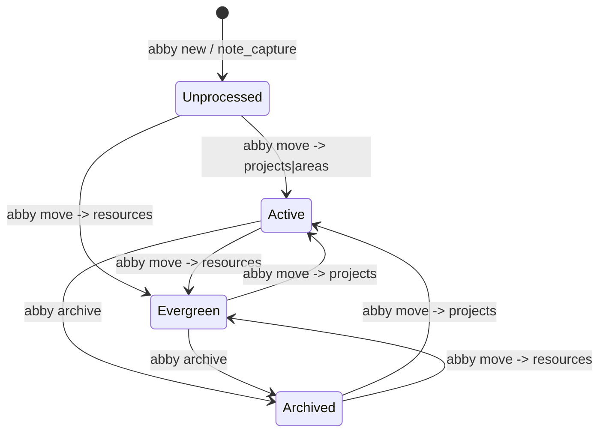
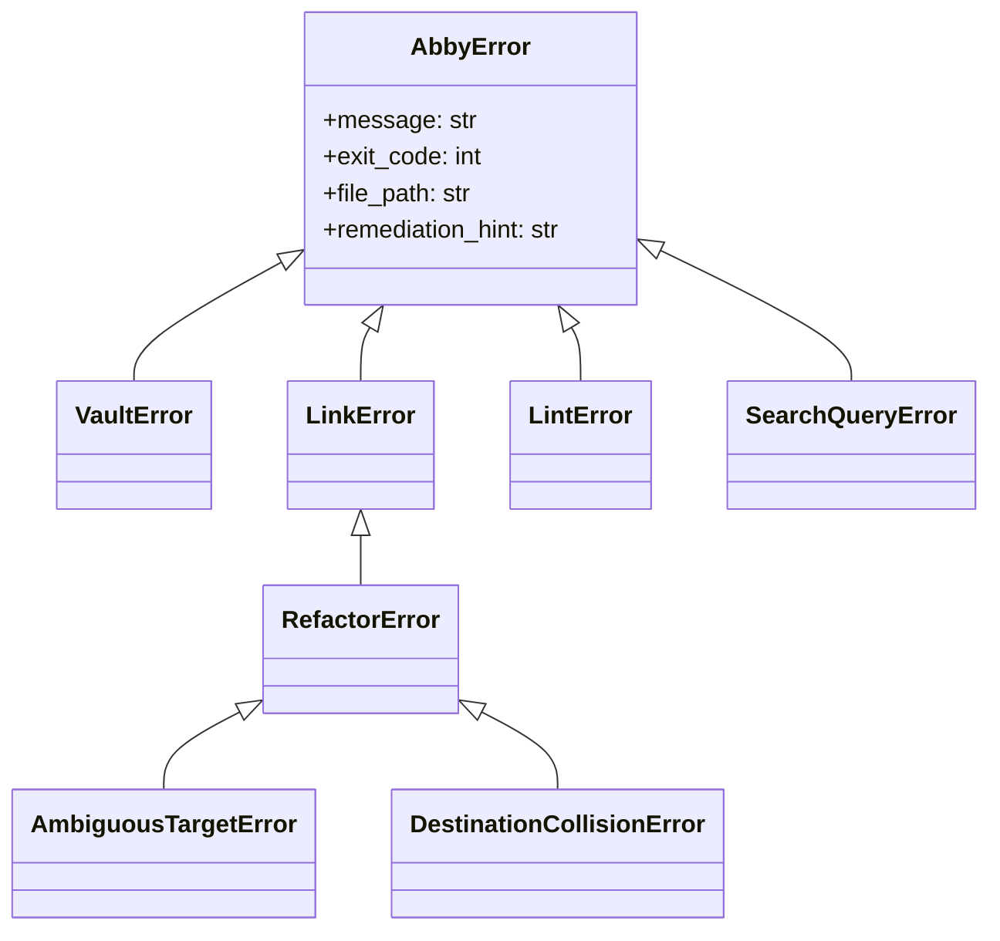

# Abby Knowledge Vault — Consolidated Specification

Normative contract for the Abby Knowledge Vault, consolidating all 17 engineering epochs (`001`–`017`) and the 6 architectural principles.

> [!IMPORTANT]
> This document is the **consolidated, current-state normative contract**. Where later features superseded earlier ones, only the surviving contract is stated here; the supersession history is recorded in [§13](#13-supersession-ledger).

**Companion document**: [`DESIGN.md`](DESIGN.md) — architecture, rationale, and rejected alternatives.

---

## 1. Scope, Conformance & Normative Language

### 1.1 Normative Keywords
`MUST`, `MUST NOT`, `SHOULD`, `MAY` are used per RFC 2119.

### 1.2 Conformance Surfaces
An implementation conforms to this specification if it satisfies all four contract surfaces:

| Surface | Definition | Section |
|---|---|---|
| **Format** | OKF v0.2 frontmatter schema and Markdown link grammars | [§3](#3-open-knowledge-format-okf-v02), [§7](#7-link-graph-contract) |
| **CLI** | `abby` command surface, flags, streams, exit codes | [§4](#4-cli-contract) |
| **MCP** | 12 JSON-RPC 2.0 stdio tools | [§5](#5-mcp-contract) |
| **Quality** | Performance budgets, architecture limits, test gates | [§10](#10-non-functional-requirements) |

### 1.3 Global Invariants
These hold across every surface and are not restated per-command.

- **INV-1 — Air Gap**: Knowledge Domain (`00`–`05`) contains only content. System Domain (`.system/`, `.agents/`) contains only code, specifications, and agent configurations. Neither MUST contaminate the other.
- **INV-2 — Zero Runtime Dependencies**: The engine MUST run on CPython 3.10+ standard library alone. Zero `pip` packages at runtime. *(Constitution III)*
- **INV-3 — Stream Isolation**: `stdout` carries the contract payload only (line-delimited relative paths, or exactly one JSON object under `--json`). All diagnostics, warnings, progress, and errors go to `stderr`. *(Constitution IV.2, VI)*
- **INV-4 — Exit Code Trichotomy**: `0` success · `1` runtime / domain / validation failure · `2` argument or syntax error. *(Constitution VI)*
- **INV-5 — Flag Position Invariance**: Global flags (`--json`, `--snippets`, `--dry-run`) MUST behave identically before or after the subcommand. `abby --json find "x"` ≡ `abby find "x" --json`.
- **INV-6 — Targeted Dry-Run Mandate**: Every command that modifies, relocates, or rewrites *existing* notes (`move`, `archive`, `verify`, `links refactor`, `lint --fix`) MUST accept `--dry-run` and MUST guarantee zero disk mutations under it. Additive intake (`new`) and idempotent scaffolding (`init`) are explicitly exempt. *(Constitution III)*
- **INV-7 — Non-Destructive Editing**: Any mutation MUST preserve note body bytes, Wikilinks, Obsidian block references (`^blockid`), unmodeled/custom frontmatter keys, and original line endings (LF/CRLF).
- **INV-8 — Disposable Cache**: `.system/cache/vault.db` is derived state. Flat Markdown is the single source of truth. Deleting the cache MUST cause zero knowledge loss and MUST trigger transparent reconstruction.

---

## 2. Domain Model (PARA+)

### 2.1 Canonical Domains

| Directory | Alias | Role | Default `status` | Default `type` |
|---|---|---|---|---|
| `00 - Inbox/` | `inbox` | Rapid capture staging | `unprocessed` | `inbox` |
| `01 - Projects/` | `projects` | Time-bound outcomes | `active` | `project-note` |
| `02 - Areas/` | `areas` | Ongoing responsibilities | `active` | `area-note` |
| `03 - Resources/` | `resources` | Evergreen reference | `evergreen` | `resource-note` |
| `04 - Archives/` | `archives` | Retired material | `archived` | `archive-note` |
| `05 - Assets/` | — | Binary media, attachments, `Templates/` | n/a (not a note domain) | n/a |

Domain resolution MUST be centralized in a single service (`abby.core.domain`) accepting aliases (`projects`), canonical names (`01 - Projects`), and numeric prefixes (`01`), normalizing `\` to `/`, and returning `None` for non-domain paths rather than raising. *(013 FR-003)*

### 2.2 Lifecycle State Machine



### 2.3 Indexing Scope
Vault-wide scans (search, lint, link graph) MUST index `00 - Inbox/` through `04 - Archives/` **only**, and MUST exclude `05 - Assets/`, `.system/`, `.obsidian/`, `.agents/`, all hidden files (`.*`), and root Markdown (`AGENTS.md`, `README.md`, `STYLE.md`). Explicit single-file paths MAY still be audited directly. *(003 FR-015, 005 FR-001, 008 FR-008)*

---

## 3. Open Knowledge Format (OKF v0.2)

### 3.1 Frontmatter Field Schema

YAML frontmatter delimited by `---`, Obsidian Properties compatible.

| Field | Type | Required | Default | Rules |
|---|---|---|---|---|
| `title` | `str` | Yes | filename stem | Double-quoted; MUST match the `# H1` heading |
| `description` | `str \| None` | Domain-gated | `None` | 15–35 words, active voice, < 250 chars. Emitted immediately below `title`. Key **omitted** when absent |
| `created` | `str` | Yes | `datetime.now().isoformat(timespec="seconds")` | ISO 8601 `YYYY-MM-DDTHH:MM:SS` |
| `updated` | `str \| None` | No | `None` | ISO 8601; touched on every mutation |
| `type` | `str` | Yes | `inbox` | `inbox` · `project-note` · `area-note` · `resource-note` · `archive-note` |
| `status` | `str` | Yes | `unprocessed` | `unprocessed` · `active` · `evergreen` · `archived` |
| `tags` | `list[str]` | Yes | `["inbox"]` | Flat kebab-case. No `#` prefix, no spaces, no camelCase/snake_case. `/` permitted for hierarchy |
| `generated` | `{by, at?}` | No | `None` | `by` required; actor syntax per [§3.4](#34-actor-syntax) |
| `verified` | `list[{by, at}]` | No | `[]` | Bare mapping normalized to a 1-element list (OKF §5.2) |
| `stale_after` | `str \| None` | No | `None` | **Absolute** ISO 8601 UTC instant. No relative TTL, no per-type default |
| `sources` | `list[mapping]` | No | `[]` | Each entry requires `resource`; see [§3.5](#35-source-attribution) |
| *(custom)* | `Any` | No | — | Arbitrary user YAML preserved verbatim in `custom_fields` |

**Computed, never stored**: `trust_tier` ([§3.2](#32-trust-tier-derivation)), `is_stale` ([§3.3](#33-staleness-evaluation)).

### 3.2 Trust Tier Derivation

Trust tiers MUST be derived at read time from the `verified` array. Storing a `trust_tier:` key in frontmatter is **prohibited** — self-asserted trust is not trust. *(012 FR-003)*

```python
def resolve_trust_tier(verified: Optional[list[dict[str, str]]]) -> str:
    if not verified:
        return TrustTier.UNVERIFIED
    for entry in verified:
        if str(entry.get("by", "")).strip().startswith("human:"):
            return TrustTier.HUMAN_REVIEWED
    return TrustTier.MACHINE_CONFIRMED
```

| Tier | Condition | Epistemic authority |
|---|---|---|
| `human-reviewed` | ≥ 1 verifier actor prefixed `human:` | Highest — overrides machine assertions |
| `machine-confirmed` | `verified` non-empty, zero `human:` actors | Agent-synthesized; cite with disclaimer |
| `unverified` | `verified` absent, null, or empty | Raw capture; not authoritative |

Ascension is monotonic in practice: `unverified → machine-confirmed → human-reviewed`, and a human verification on an unverified note jumps directly to `human-reviewed`. Re-verification by an existing actor MUST update that actor's `at` rather than appending a duplicate entry.

> [!IMPORTANT]
> Agents MUST NOT emit `human:*` verifier actors. This is a constitutional prohibition, not a convention.

### 3.3 Staleness Evaluation

```python
def evaluate_staleness(stale_after: Optional[str]) -> bool:
    if not stale_after or not str(stale_after).strip():
        return False
    return is_timestamp_stale(unescape_yaml_string(str(stale_after)).strip())
```

`is_stale` is `True` iff `datetime.now(timezone.utc) >= stale_after`. Absent, empty, or unparseable values MUST yield `False` (with an `invalid-stale-after-date` lint warning for the unparseable case). Absence means *"no predetermined expiration"*, never *"expired"*.

### 3.4 Actor Syntax

```python
parse_actor(actor) -> Optional[tuple[str, str]]
```

Accepted forms — whitespace anywhere invalidates the actor:

| Form | Example | Meaning |
|---|---|---|
| `human:<id>` | `human:bookian` | Human attestation |
| `agent:<id>` | `agent:curator` | AI agent |
| `tool:<id>` | `tool:abby-lint` | Deterministic tool |
| `process:<id>` | `process:nightly-sync` | Automated process |
| `<producer>/<id>` | `abby/agent:synthesizer` | Namespaced producer |

**Default actor derivation** (`abby verify` with no `--by`) MUST slugify the system username:

```python
clean = re.sub(r"[^a-zA-Z0-9._-]", "-", user.strip()).strip("-").lower() or "user"
return f"human:{clean}"
```

`ABBY_USER="John Doe"` → `human:john-doe`. This function MUST NOT raise regardless of username content. *(014 FR-007)*

### 3.5 Source Attribution

| Field | Type | Required | Constraint |
|---|---|---|---|
| `resource` | `str` | **Yes** | Non-empty URI, URL, DOI, or internal path |
| `id` | `str` | No | Short citation key (`ongaro2014`) |
| `title` | `str` | No | Full publication title |
| `author` | `str` | No | Author(s) or organization |
| `usage_count` | `int` | No | Positive integer |
| `last_modified` | `str` | No | Valid ISO 8601 date or datetime |

`sources` content MUST be indexed into full-text search as a concatenated payload `Sources: [Title] by [Author] ([Resource])`, appended to the indexed body buffer — **not** as a dedicated FTS5 column, so existing caches need no migration. *(014 FR-004)*

### 3.6 Description Lifecycle Gating

`description` is free at capture and enforced on graduation. *(011 FR-009)*

| Domain | Standard mode | `--strict` mode |
|---|---|---|
| `00 - Inbox/` | Pass (silent) | Pass (silent) |
| `01 - Projects/` · `02 - Areas/` · `03 - Resources/` | Warning | **Fail (exit 1)** |
| `04 - Archives/` | Pass (silent) | Pass (silent) |

Whitespace-only descriptions MUST be treated as missing. Multi-line folded scalars MUST be collapsed to a single string.

---

## 4. CLI Contract

### 4.1 Global Surface

```
abby [--json] [--snippets] [-v|--version] [-h|--help] <command> [args]
```

Commands: `check` · `init` · `new` · `info` · `list` · `doctor` · `cache` · `move` · `archive` · `verify` · `find` · `links` · `lint` · `mcp`

### 4.2 Vault Health & Scaffolding

**`abby check [--json]`** — Read-only structural audit. MUST NOT modify the filesystem.
JSON: `{healthy, vault_root, directories{<name>:{exists, is_dir, item_count}}, missing_directories[]}`.
Exit: `0` all present · `1` any missing.

**`abby init [--json]`** — Idempotent scaffolding. MUST NOT overwrite, truncate, or reset any existing file.
Creates: `00`–`05`, `.system`, `05 - Assets/Templates/`, `STYLE.md`, `AGENTS.md`, and the 5 canonical templates.
JSON: `{success, vault_root, created[], existed[], style_initialized, agents_initialized, templates_initialized}`.
Exit: `0` success · `1` not a vault root · `2` syntax error.

**`abby info [--json]`** — Environment diagnostics.
JSON: `{cli_version, vault_root, python_version, system_path, status}`. Exit: `0`.

**`abby doctor [--json]`** — Holistic health and integrity diagnostics: Python ≥ 3.10, PARA+ structure, SQLite `PRAGMA integrity_check`, MCP launcher permissions, authoritative guides, starter templates.
Exit: `0` passed or warnings only · `1` one or more checks failed.

**`abby cache [status|rebuild|prune] [--json]`**
- `status` — database path, schema version, file/WAL size, record counts for `notes`, `note_links`, `note_tags`, `notes_fts`.
- `rebuild` — purge and fully re-index from disk.
- `prune` — sync and delete records for notes removed from disk.

Exit: `0` success · `1` database error.

> [!WARNING]
> `abby find --rebuild-cache ""` is **deprecated**. Use `abby cache rebuild`. Documentation, skills, and subagent prompts MUST NOT reference the deprecated form. *(017 SC-002)*

### 4.3 Intake & Lifecycle

**`abby new <title> [--body TEXT] [--description DESC] [--tags TAGS] [--generated-by ACTOR] [--json]`**

- Body precedence: `--body` → piped `stdin` (up to 1 MB) → clean placeholder structure.
- Filename: `<Sanitized Title>.md`. Characters `/ \ : * ? " < > |` stripped or dash-replaced. Title byte length capped at 240 to fit OS 255-byte limits.
- Collision: append ` (1)`…` (999)`. MUST NEVER overwrite.
- `--generated-by` stamps `generated: {by: <actor>, at: <now_utc>}`.
- Text output: **exclusively** the created relative path (shell-composable — `code "$(abby new 'Note')"`).
- JSON: `{success, path, title, created, filename}`.

Exit: `0` success · `2` empty/missing title. **Exempt from `--dry-run`** (additive, collision-safe).

**`abby list [domain] [--json]`** — FIFO (oldest-first) queue listing, defaults to `inbox`.
JSON: `{domain, count, notes[{filename, path, title, created, age_days, status}]}`.
Exit: `0` · `1` invalid domain · `2` syntax error.

**`abby move <note> <target> [--description DESC] [--dry-run] [--json]`**

- `<target>`: alias (`projects`), nested subpath (`projects/Apollo`), or canonical path. Missing destination subdirectories are scaffolded automatically **within a recognized PARA domain only**.
- MUST atomically update `status`, `type`, and `updated` to domain defaults, preserving body, Wikilinks, `^blockid`, and custom keys verbatim.
- `--description` injects or overwrites `description`; omission preserves any existing value.
- MUST reject targets inside `.system/`, `.obsidian/`, or outside the vault root (exit `1`).
- Dry-run text: `[DRY-RUN] Planned move: '<src>' -> '<dst>' (status: active, type: project-note)`.

JSON: `{success, source_path, target_path, title, previous_status, new_status, description, timestamp, is_dry_run}`.
Exit: `0` · `1` note not found / invalid target / ambiguous · `2` missing argument.

**`abby archive <note> [--dry-run] [--json]`** — Relocate to `04 - Archives/`, set `status: archived`.
Dry-run text: `[DRY-RUN] Planned archive: '<src>' -> '04 - Archives/<name>.md' (status: archived)`.
JSON: `{success, source_path, target_path, title, archived_at, is_dry_run}`.
Exit: `0` · `1` note not found · `2` missing argument.

**`abby verify <note> [--by ACTOR] [--dry-run] [--json]`** — Append a verification attestation, recomputing the trust tier. Non-destructive: touches the frontmatter block only.

```
Verified: 03 - Resources/Raft Consensus.md
  Actor:      human:bookian
  Timestamp:  2026-09-18T16:45:00Z
  Trust Tier: human-reviewed
```

Dry-run additionally prints `Old Trust Tier` / `New Trust Tier` and `Zero files modified.`
JSON: `{path, actor, timestamp, trust_tier, dry_run}`.
Exit: `0` · `1` note not found / unparseable frontmatter · `2` malformed actor string.

### 4.4 Search

```
abby find [query] [-t|--title-only | -c|--content-only]
          [--status S] [--tag T ...] [--any-tag] [--domain D] [--type T]
          [--created-after DATE] [--created-before DATE]
          [--updated-after DATE] [--updated-before DATE]
          [-n|--limit N] [-r|--rebuild-cache]
          [--snippets] [--trust TIER] [--fresh-only] [--stale] [--json]
```

- `query` accepts a keyword, quoted phrase (`"database migration"`), prefix wildcard (`arch*`), or regular expression.
- Multiple `--tag` values are **AND** by default; `--any-tag` switches to **OR**.
- `--trust` enum: `unverified` · `machine-confirmed` · `human-reviewed`.
- `--fresh-only` and `--stale` are mutually exclusive in effect (`stale_after IS NULL OR stale_after > now` vs `stale_after <= now`).
- An empty query with no filters returns all indexed notes.

**Text output without `--snippets`** — strictly one relative path per line, zero decorative output.

**Text output with `--snippets`**:
```
Found 2 matching note(s):

- Raft Consensus (03 - Resources/Raft Consensus.md) [03 - Resources | evergreen | human-reviewed | 8 links]
  Description: Distributed consensus protocol utilizing leader election and replicated log state.
  Snippet: ... **Raft consensus** guarantees safety under asynchronous network partitions ...
```

Match header format: `[<Domain> | <Status> | <TrustTier> | <N> links]`, with `[stale]` appended for expired notes. Zero-backlink notes render `0 links`.

**JSON output**:
```json
{
  "query": "consensus", "count": 2, "total_matches": 2,
  "notes": [{
    "filename": "Raft Consensus.md", "path": "03 - Resources/Raft Consensus.md",
    "title": "Raft Consensus", "domain": "03 - Resources", "status": "evergreen",
    "type": "resource-note", "description": "...", "created": "...", "updated": "...",
    "tags": ["distributed-systems"], "snippet": "... **Raft** ...",
    "trust_tier": "human-reviewed", "is_stale": false, "active_backlinks": 8
  }]
}
```

`snippet` is `null` when `--snippets` is omitted. Exit: `0` (including zero matches) · `1` invalid domain / database error · `2` invalid date, negative limit, malformed regex.

### 4.5 Link Graph

```
abby links [note] [-b|--backlinks] [--broken] [--headings] [--strict]
           [--orphans] [--unreferenced] [--include-inbox]
           [--domain D] [-v|--details] [--depth {1,2,3}] [--json]
abby links refactor <source> <target> [--dry-run] [--links-only] [--force] [--json]
```

| Mode | Semantics |
|---|---|
| *(default)* | Outbound links from `<note>` |
| `--backlinks` | Inbound references to `<note>` |
| `--broken` | Vault-wide unresolved targets. Heading-anchor validation is **off** by default; enable with `--headings` |
| `--orphans` | Zero inbound **and** zero outbound links |
| `--unreferenced` | Zero inbound links (leaf notes) |
| `refactor` | Vault-wide rename + inbound link rewrite |

- `--orphans` / `--unreferenced` exclude `00 - Inbox/` unless `--include-inbox`.
- `--strict` (with `--broken`) exits `1` if any broken link exists.
- `--depth {1,2,3}` performs BFS multi-hop traversal with cycle detection via a `visited` set. Depth is capped at 3 to prevent exponential expansion.
- Unresolved targets are prefixed `[unresolved] ` in text mode.

Multi-hop text output MUST group by depth section:
```
## Depth 1 (Direct)
  03 - Resources/Self-Attention.md (wikilink, line 12)

## Depth 2 (Transitive)
  03 - Resources/Dot Product.md (wikilink, line 5, via Self-Attention.md)
```

Refactor MUST preserve aliases (`|Alias`) and anchors (`#Heading`), reject ambiguous targets unless `--force`, and abort before any mutation on destination collision. `--links-only` rewrites inbound links without renaming the source file.

Exit: `0` · `1` note not found / `--strict` broken links / ambiguous target / destination collision · `2` invalid flags or domain.

### 4.6 Schema Governance

```
abby lint [note] [--domain D] [--fix] [--dry-run] [--strict] [--json]
```

- Scoping: single note · `--domain` · vault-wide (default).
- `--dry-run` requires `--fix`.
- `--strict` exits `1` on **any** violation, error or warning (zero-tolerance CI gate).
- `--fix` modifies in place with **no `.bak` sidecars**; recovery relies on `--dry-run`, Git, and Obsidian File Recovery.

JSON (`LintReport`): `{total_audited, clean_notes, total_violations, total_errors, total_warnings, violations[{file_path, field, rule, severity, message, line_number, is_fixable, suggested_value}], fixed_notes, fixed_violations, exit_code}`.

Exit: `0` clean, or non-strict with violations · `1` `--strict` violations or fatal runtime error · `2` invalid domain or unknown flag.

Full rule registry: [§8](#8-lint-rule-registry).

### 4.7 Server

**`abby mcp`** — Start the JSON-RPC 2.0 stdio server; runs until EOF. Also invocable via `.system/abby/bin/abby-mcp`.

---

## 5. MCP Contract

### 5.1 Protocol

JSON-RPC 2.0 over stdio. Every message is a single line of UTF-8 JSON terminated by `\n`, flushed immediately.

> [!CAUTION]
> `stdout` is reserved exclusively for JSON-RPC frames. Any extraneous `print()` corrupts client deserialization. All diagnostics MUST route to `stderr`.

| Method | Params | Result |
|---|---|---|
| `initialize` | `{protocolVersion, capabilities, clientInfo}` | `{protocolVersion: "2024-11-05", capabilities: {tools:{}}, serverInfo: {name:"abby", version:"1.0.0"}}` |
| `notifications/initialized` | — | *(notification — no response)* |
| `ping` | — | `{}` |
| `tools/list` | — | `{tools: [{name, description, inputSchema}]}` |
| `tools/call` | `{name, arguments}` | `{content: [{type:"text", text}], isError: bool}` |

Protocol errors use standard codes: `-32700` parse · `-32600` invalid request · `-32601` method not found · `-32602` invalid params · `-32603` internal.

**Tool-level failures MUST return `result` with `isError: true`, never a JSON-RPC error, and MUST NOT terminate the server loop.** On `EOF`/`SIGINT`/`SIGTERM` the server releases DB handles and exits `0`.

### 5.2 Tool Registry — Exactly 12 Tools

| Tool | Parameters (`*` = required) | Delegates to |
|---|---|---|
| `vault_check` | — | `core.health.audit_vault_health` |
| `vault_init` | — | `core.init.scaffold_vault_directories` |
| `note_capture` | `title*`, `body`, `description`, `tags[]`, `generated{by,at}`, `verified[{by*,at}]`, `sources[{resource*,id,title,author}]` | `core.intake` |
| `domain_list` | `domain` (default `"inbox"`) | `core.lifecycle.list_domain_notes` |
| `note_read` | `note*` | `core.resolution` + parser |
| `note_move` | `note*`, `target*`, `description`, `dry_run` (default `false`) | `core.lifecycle.move_note` |
| `note_archive` | `note*`, `dry_run` (default `false`) | `core.lifecycle.archive_note` |
| `note_verify` | `note_path*`, `actor`, `dry_run` (default `false`) | `core.verify` |
| `note_refactor` | `source*`, `target*`, `links_only` (default `false`), `dry_run` (default `false`) | `core.graph.refactor.refactor_note` |
| `vault_search` | `query`, `domain`, `status`, `type`, `tags[]`, `limit` (default `20`, max `100`), `snippets` (default `false`), `trust_tier` (enum), `fresh_only` (default `false`) | `core.search` |
| `vault_links` | `note`, `mode` (enum `outbound\|backlinks\|broken\|orphans\|unreferenced`, default `outbound`), `depth` (1–3, default `1`), `headings` (default `false`), `domain` | `core.graph` |
| `vault_lint` | `note`, `domain`, `fix` (default `false`), `dry_run` (default `false`) | `services.lint` |

### 5.3 Parity & Payload Requirements

- **CLI/MCP parity**: MCP operations MUST produce byte-identical on-disk state to their CLI counterparts. Both surfaces delegate to the same service layer; neither reimplements logic. *(006 SC-004)*
- **`note_read` payload**: JSON string in `content[0].text` with keys `{path, title, frontmatter, body, content}`. `frontmatter` includes computed `trust_tier` and `is_stale`. `body` has fences stripped; `content` is the exact raw file text for verbatim citation.
- **Ambiguity convention**: ambiguous targets MUST return `isError: true` with enumerated candidates and a qualification hint — never a stack trace:
  ```
  Note 'X' is ambiguous. Candidates:
    - 01 - Projects/X.md
    - 03 - Resources/X.md
  Please qualify with a domain prefix.
  ```
- **Pagination bound**: `vault_search` defaults to 20 and caps at 100 results to protect the client token window.

---

## 6. Search & Ranking Contract

### 6.1 Full-Text Index

```sql
CREATE VIRTUAL TABLE notes_fts USING fts5(
    path UNINDEXED, title, description, body, tags, tokenize = 'unicode61'
);
```

**BM25 column weights**: `bm25(notes_fts, 0.0, 10.0, 7.0, 1.0, 5.0)` — path `0.0` (unindexed) · title `10.0` · description `7.0` · body `1.0` · tags `5.0`.

### 6.2 Cognitive Ranking Multiplier

Raw BM25 relevance MUST be modulated by four orthogonal signals:

$$\text{FinalScore} = \text{BM25} \times M_{\text{domain}} \times M_{\text{trust}} \times M_{\text{fresh}} \times M_{\text{graph}}$$

| Signal | Condition | Multiplier |
|---|---|---|
| $M_{\text{domain}}$ | `03 - Resources` | `1.20` |
| | `01 - Projects`, `02 - Areas`, unknown | `1.00` |
| | `00 - Inbox` | `0.80` |
| | `04 - Archives` | `0.35` |
| $M_{\text{trust}}$ | `human-reviewed` | `1.25` |
| | `machine-confirmed` | `1.00` |
| | `unverified`, unknown, missing | `0.90` |
| $M_{\text{fresh}}$ | `is_stale == True` | `0.60` |
| | fresh or no expiration | `1.00` |
| $M_{\text{graph}}$ | see below | `1.00` → `1.75` |

**Graph centrality** — bounded logarithmic inbound-link boost:

$$M_{\text{graph}} = \min\left(1.0 + 0.15 \times \log_2\left(1 + \min(B,\ 31)\right),\ 1.75\right)$$

where $B$ = `active_backlinks`. Reference points: $B{=}0 \to 1.00$ · $B{=}1 \to 1.15$ · $B{=}3 \to 1.30$ · $B{=}7 \to 1.45$ · $B{=}15 \to 1.60$ · $B{\ge}31 \to 1.75$.

The multiplier MUST be implemented as a registered Python SQLite callback `COGNITIVE_RANK_MULTIPLIER(domain, trust_tier, stale_after, active_backlinks)`, not as inline SQL `CASE` arithmetic — SQLite's `log2` lives in an optional math extension that is absent on some distributions.

```sql
ORDER BY (bm25(notes_fts, 0.0, 10.0, 7.0, 1.0, 5.0) *
          COGNITIVE_RANK_MULTIPLIER(notes.domain, notes.trust_tier,
                                    notes.stale_after, notes.active_backlinks)) ASC,
         COALESCE(notes.updated, notes.created) DESC,
         notes.file_mtime DESC,
         notes.path ASC
```

> [!NOTE]
> FTS5 `bm25()` returns **negative** floats. A multiplier > 1.0 makes the score more negative, ranking it higher under `ASC`. An empty query skips BM25 entirely and falls back to `COALESCE(updated, created) DESC`.

Archives are **soft-demoted (0.35×), never excluded** — a highly relevant historical note can still surface on an exact match.

### 6.3 Active Backlink Materialization

`active_backlinks` MUST be materialized during `sync_cache()` (never computed per query, which costs 15–30 ms per search):

```sql
UPDATE notes SET active_backlinks = (
    SELECT COUNT(DISTINCT nl.source_path)
    FROM note_links nl
    JOIN notes src ON nl.source_path = src.path
    WHERE nl.target_path = notes.path
      AND src.domain != '04 - Archives'
);
```

Edge semantics: five wikilinks from one source count as **1** backlink (`DISTINCT source_path`); archive sources contribute **0** (preventing retired-project echo chambers from inflating centrality); a cycle `A↔B` counts as exactly 1 each.

### 6.4 Snippet Extraction

Three-tier fallback, guaranteeing every match carries an informative excerpt:

1. **Body match** — `snippet(notes_fts, 3, '**', '**', '...', 20)` executed inside the SQLite C engine alongside BM25 ranking.
2. **Regex query** — `re.search()` over the cached body, windowing ±50 characters around the match span and wrapping it in `**`.
3. **Metadata-only / title-only / tag-only match** — prefer `description`; otherwise the first non-empty body lines up to 120 characters followed by `...`.

Window target: ~100–160 characters. Matched terms are wrapped in `**term**`; elided edges render as ` ... `. Markdown headers, `^blockid`, and table pipes MUST be sanitized for legible inline prose. Returning `null` for a match is prohibited — it reads as a broken result.

### 6.5 Incremental Sync

On every invocation the engine MUST perform a freshness audit before querying: `os.scandir()` stat scan over `00`–`04`, diff `(file_mtime, file_size)` against cached records, upsert new/modified notes, prune deleted ones — all inside a single WAL transaction. No background daemon or file watcher is permitted (Constitution III). A missing or corrupt database MUST emit a `stderr` warning, delete the file, and rebuild silently.

---

## 7. Link Graph Contract

### 7.1 Link Grammars

**Wikilink** — `!?[[Target(#Heading)?(|Alias)?]]`
```
(!?)\[\[([^\]|#\r\n]+)(?:#([^\]|\r\n]+))?(?:\|([^\]\r\n]+))?\]\]
```

**Relative Markdown link** — `!?[Label](path ("title")?)`
```
(!?)\[([^\]\r\n]*)\]\(([^)\s\r\n]+)(?:\s+"([^"\r\n]*)")?\)
```

External schemes (`http://`, `https://`, `mailto:`, `ftp://`, `data:`) and in-page anchors (`#...`) MUST be excluded. Paths are decoded with `urllib.parse.unquote`.

### 7.2 Code-Fence Immunity

Link syntax inside fenced (``` / `~~~`) and inline (`` ` ``) code MUST be ignored. Masking MUST replace code characters with whitespace **while preserving every `\n`**, so 1-indexed line numbers remain exact.

### 7.3 Resolution Order

1. Direct path match (when the target contains separators)
2. Case-insensitive filename-stem match across `00`–`04`
3. Case-insensitive frontmatter `title:` match
4. Asset fallback into `05 - Assets/` for embeds and media extensions
5. Otherwise → **ambiguous** (all candidates returned) or **unresolved**

Self-referencing links (`[[#Summary]]`) are neither broken nor backlinks. Arbitrary domain precedence is prohibited — silent mis-resolution corrupts the graph.

### 7.4 Refactor Transaction

Three-phase, fully invertible. See [`DESIGN.md` §8](DESIGN.md#8-safety--resilience-architecture) for the rollback design.

| Phase | Steps |
|---|---|
| **1. Planning** *(read-only)* | Resolve source, detect ambiguity, check destination collision, scan vault and generate planned rewrites |
| **2. Execution** *(rollback envelope)* | Rewrite inbound links → rename file → mutate frontmatter `title` + `updated`. Each step pushes an inverse closure |
| **3. Completion** | Clear rollback stack, sync cache, return `RefactorResult` |

On any failure, completed operations MUST be rolled back in **LIFO** order. Each rollback closure MUST be individually guarded so a single failing rollback does not abort the remainder; `RefactorError` MUST then carry diagnostics for **all** failed rollbacks.

Refactoring MUST be idempotent — a repeat run reports 0 changes. A note with zero inbound references still renames and updates its frontmatter title, reporting 0 rewrites.

---

## 8. Lint Rule Registry

### 8.1 Severity Semantics

- **error** — structural or schema failure. Blocks in all modes.
- **warning** — alignment or hygiene issue. Advisory in standard mode; exits `1` under `--strict`.

### 8.2 Rules

| Rule ID | Field | Severity | Fixable | Remediation |
|---|---|---|---|---|
| `syntax-missing-frontmatter` | frontmatter | error | ✅ | Inject canonical OKF header |
| `syntax-unclosed-frontmatter` | frontmatter | error | ✅ | Append closing `---` |
| `missing-title` | title | error | ✅ | Derive from sanitized file stem |
| `missing-created` | created | error | ✅ | File `ctime`/`mtime`, else now |
| `invalid-created-date` | created | error | ✅ | Normalize to ISO 8601 |
| `invalid-type` | type | error | ✅ | Domain default |
| `invalid-status` | status | error | ✅ | Domain default |
| `invalid-tags-format` | tags | error | ✅ | Coerce scalar/CSV to list |
| `missing-description` | description | warning¹ | ❌ | Author 15–35 word summary |
| `tag-has-hash` | tags | warning | ✅ | Strip leading `#` |
| `tag-has-whitespace` | tags | warning | ❌ | Manual edit required |
| `domain-type-mismatch` | domain | warning | ✅ | Align to domain default |
| `domain-status-mismatch` | domain | warning | ✅ | Align to domain default |
| `invalid-actor-format` | generated/verified | warning | ❌ | Conform to [§3.4](#34-actor-syntax) |
| `invalid-generated-date` | generated | warning | ❌ | Valid ISO 8601 |
| `invalid-verified-date` | verified | warning | ❌ | Valid ISO 8601 |
| `invalid-stale-after-date` | stale_after | warning | ❌ | Valid ISO 8601 UTC instant |
| `invalid-sources-format` | sources | warning | ❌ | Must be a list of mappings |
| `missing-source-resource` | sources | warning | ❌ | Add required `resource` |
| `invalid-source-date` | sources | warning | ❌ | Valid ISO 8601 `last_modified` |
| `file-read-error` | — | error | ❌ | Permission/encoding failure |

¹ Silent in `00 - Inbox/` and `04 - Archives/` per [§3.6](#36-description-lifecycle-gating).

### 8.3 Remediation Guarantees

Auto-fix MUST preserve custom/unmodeled frontmatter keys, body bytes, `^blockid` references, and original line endings. Wholesale frontmatter regeneration is prohibited — it erases `aliases`, `cssclass`, and `publish`. Frontmatter reading MUST stop at the closing `---` or 100 lines, whichever comes first.

---

## 9. Persistence Contract

Single disposable database at `.system/cache/vault.db` (gitignored, WAL mode, foreign keys on). `PRAGMA user_version` holds `CACHE_SCHEMA_VERSION`; a mismatch triggers a full cache-busting rebuild.

```sql
CREATE TABLE notes (
    path             TEXT PRIMARY KEY,
    domain           TEXT NOT NULL,
    status           TEXT NOT NULL,
    type             TEXT NOT NULL,
    title            TEXT NOT NULL,
    description      TEXT,
    trust_tier       TEXT DEFAULT 'unverified',
    stale_after      TEXT,
    active_backlinks INTEGER DEFAULT 0,
    created          TEXT,
    updated          TEXT,
    file_mtime       REAL NOT NULL,
    file_size        INTEGER NOT NULL
);

CREATE TABLE note_tags (
    path TEXT NOT NULL,
    tag  TEXT NOT NULL,
    PRIMARY KEY (path, tag),
    FOREIGN KEY (path) REFERENCES notes(path) ON DELETE CASCADE
);

CREATE TABLE note_links (
    id             INTEGER PRIMARY KEY AUTOINCREMENT,
    source_path    TEXT NOT NULL,
    target_title   TEXT NOT NULL,
    target_heading TEXT,
    target_alias   TEXT,
    target_path    TEXT,
    link_syntax    TEXT NOT NULL CHECK (link_syntax IN ('wikilink', 'markdown')),
    is_embed       INTEGER NOT NULL DEFAULT 0,
    line_number    INTEGER NOT NULL,
    FOREIGN KEY (source_path) REFERENCES notes(path) ON DELETE CASCADE
);

CREATE VIRTUAL TABLE notes_fts USING fts5(
    path UNINDEXED, title, description, body, tags, tokenize = 'unicode61'
);
```

Indexes: `idx_notes_{domain,status,type,updated,trust_tier,active_backlinks}`, `idx_note_tags_tag`, `idx_note_links_{source,source_line,target_title COLLATE NOCASE,target_path,target_source}`.

Schema evolution MUST be idempotent (`ALTER TABLE ... ` guarded by `PRAGMA table_info`). Adding an FTS5 column requires `DROP` + `CREATE` of the virtual table, which is safe precisely because the cache is disposable.

---

## 10. Non-Functional Requirements

### 10.1 Performance Budgets

| Operation | Budget | Scale |
|---|---|---|
| CLI cold start | < 50 ms | — |
| MCP startup → ready | < 20 ms | — |
| MCP handshake (`initialize` + `tools/list`) | < 50 ms | — |
| Incremental stat audit (`sync_cache`) | < 5 ms | 1,000 notes |
| Active backlink materialization | < 50 ms | 1,000 notes |
| FTS5 search query | < 25 ms | 1,000 notes |
| Search + snippet extraction | < 15 ms | 1,000 notes |
| Backlink lookup (warm cache) | < 10 ms | 1,000 notes |
| Multi-hop traversal (depth 2) | < 30 ms | — |
| Vault-wide broken-link audit | < 50 ms | 1,000 notes |
| `abby lint` vault scan | < 1 s | 1,000 notes |
| `abby verify` | < 50 ms | — |
| `note_read` (MCP) | < 50 ms | — |
| Dry-run simulation | < 10 ms | — |
| `abby init` full scaffold | < 1 s | fresh vault |

Design scale target: **10,000+ notes**, with the trust/search subsystems specified to 100,000+.

### 10.2 Architecture Limits

| Constraint | Limit | Enforcement |
|---|---|---|
| Runtime dependencies | **0** pip packages | `test_architecture.py` |
| Module length | < 500 LOC target, < 750 LOC hard | `test_architecture.py` |
| Cyclomatic complexity | **CC ≤ 20** all functions; **CC ≤ 15** new pipeline stages | AST gate |
| Deferred/mid-file imports | **0** (PEP 8 header placement) | AST gate |
| Circular dependencies | **0** | AST gate |
| Dynamic shims (`__getattr__`) | **0** | AST gate |
| Layer direction | `models`/`utils` → `core`/`services` → `cli`/`mcp` | AST gate |

Cyclomatic complexity is defined as $CC = 1 + N_{\text{decision points}}$, counting `ast.If`, `ast.IfExp`, `ast.For`, `ast.AsyncFor`, `ast.While`, `ast.ExceptHandler`, `ast.With`, `ast.AsyncWith`, and `ast.BoolOp` (contributing `len(values) - 1`).

### 10.3 Test Discipline

```
.system/abby/bin/abby-test [all|unit|integration|typecheck|arch|<file>]
                           [-k FILTER] [-x|--failfast] [-s|--sequential]
                           [-v|--verbose] [--strict]
```

| Tier | Purpose | Budget |
|---|---|---|
| `arch` | AST gate: LOC, CC, imports, layering | **< 3.0 s** |
| `unit` | Pure logic, no disk I/O | — |
| `integration` | Filesystem, CLI, MCP end-to-end | — |
| `all` | Full parallel suite (8 workers) | **< 20 s** |
| `typecheck` | Static type verification (mypy/pyright) | optional gate |
| `<file>` | Single targeted file | < 0.5 s |

Mandatory properties:

- **Zero-dependency execution** — `unittest` only, no external runners.
- **Deterministic sandbox isolation** — every test runs in `tempfile.TemporaryDirectory`. Tests MUST NEVER mutate `00`–`05` of the live vault; verified with `git status --porcelain`.
- **Three-tier coverage** — pure logic · filesystem state mutation · CLI/MCP entrypoint.
- **Full exit-code matrix** — every command tests `0`, `1`, and `2` paths.
- **Defensive/negative testing** — invalid input, Unicode/CJK, long-path boundaries, and failure when invoked outside a vault.
- **Dry-run non-mutation assertions** — every mutating command asserts accurate preview output *and* zero files created, modified, or deleted.
- **Warning gate** — `python3 -W error::UserWarning` — zero warnings tolerated.

Static typing is an engineering gate only; the runtime remains 100% standard library.

---

## 11. Error Contract

### 11.1 Exception Hierarchy

All domain exceptions root at `AbbyError(Exception)` carrying `message`, `exit_code: int = 1`, `file_path: Optional[str]`, and `remediation_hint: Optional[str]`.



| Exception | Exit | JSON payload |
|---|---|---|
| `AbbyError`, `VaultError`, `LinkError`, `LintError` | `1` | `{"success": false, "error": msg}` |
| `AmbiguousTargetError` | `1` | `{"success": false, "error": msg, "candidate_paths": [...]}` |
| `DestinationCollisionError` | `1` | `{"success": false, "error": msg}` |
| `SearchQueryError` | **`2`** | `{"success": false, "error": msg}` |
| Argument/syntax error | `2` | `{"success": false, "error": msg}` |

### 11.2 Layer Responsibilities

> [!IMPORTANT]
> Code in `core/` and `services/` MUST NOT write to `sys.stdout`/`sys.stderr` and MUST NOT call `sys.exit()`. It communicates exclusively via return values and typed exceptions.

The CLI layer catches domain exceptions and maps them to exit codes. The MCP layer catches the same exceptions and maps them to `isError: true` results without terminating the process. This is what makes one service layer serve two transports.

---

## 12. Requirements Traceability

| Feature | Title | FRs | Consolidated into |
|---|---|---|---|
| 001 | Scaffold `.system` CLI | 9 + 8 sub | §4.2, §4.3 |
| 002 | Note Lifecycle & Triage (PARA+) | 12 | §2, §4.3 |
| 003 | Vault Discovery & Search | 18 | §4.4, §6, §9 |
| 004 | Wikilinks, Backlinks & Graph Integrity | 20 | §7, §9 |
| 005 | OKF Schema Linting & Validation | 12 | §4.6, §8 |
| 006 | Agent MCP Integration | 12 | §5, §14 |
| 007 | Codebase Maintainability & Hardening | 12 | §10.2, §11 |
| 008 | User Personalization & Sane Defaults | 12 | §4.2, §15 |
| 009 | Dry-Run Preview for Move/Archive | 10 | INV-6, §4.3 |
| 010 | Vault Knowledge Grounding | 8 | §6.4, §14 |
| 011 | OKF `description` Field | 11 | §3.1, §3.6, §6.1 |
| 012 | OKF v0.2 Trust Model | 11 | §3.2–§3.5, §4.3 |
| 013 | Codebase Quality & Architecture Refactor | 12 | §2.1, §10.2, §11 |
| 014 | Bridge OKF & Wiki-LLM Gaps | 10 | §3.5, §4.5, §5.2 |
| 015 | Cognitive Graph Search | 11 | §6.2, §6.3 |
| 016 | Maintainability & Resilience | 10 | §7.4, §10.2 |
| 017 | Docs & Agent Alignment | 9 | §10.3, §14, §15 |

**Total: 199 functional requirements across 17 features.**

---

## 13. Supersession Ledger

| Superseded | By | Change |
|---|---|---|
| 003: `abby find --rebuild-cache ""` | 017 | Replaced by `abby cache [status\|rebuild\|prune]` |
| 005/007: monolithic `services/lint.py` | 007 | Decomposed into a package with re-exports; monolith deleted |
| 011: standard label "OKF v1.4.0" | 012 | Re-based to **OKF v0.2** (upstream alignment) |
| 012: hand-rolled `validate_actor_syntax` | 013 | Unified on `models.trust.parse_actor` — the old version rejected valid `tool:<id>` actors |
| 012: `derive_default_actor()` | 014 | Slugification added; previously crashed on usernames containing spaces |
| 013: "exactly 10 MCP tools" invariant | 014 | **12 tools** — adds `note_read`, `note_refactor` |
| 013: `note_path`/`target_destination` MCP param names | 014 | Canonicalized to `note`/`target`/`source` |
| 011/013: < 750 LOC ceiling | 014, 016 | Tightened to **< 500 LOC** target (750 remains the hard failure threshold) |
| 002: interactive `abby triage` wizard | 002 clarification | Deferred indefinitely in favor of scriptable primitives |
| 017: automated asset-parity tests | 017 clarification | Explicitly rejected — parity maintained manually via `diff` |

### 13.1 Reconciled Drift

Resolved discrepancies between spec text and the implemented engine. **The implementation is authoritative where it is provably equivalent or more correct.**

| Item | Spec says | Engine does | Resolution |
|---|---|---|---|
| Graph centrality cap | `min(B, 32)` | `min(B, 31)` + hard clamp `1.75` | **Equivalent.** `log2(1+32)` yields `1.756` → clamped to `1.75`; `log2(1+31)` yields exactly `1.75`. Engine form is cleaner. §6.2 states the engine form |
| Suite wall-clock | 016: < 15 s / 54 files · 017: < 20 s / 65 suites | 69 test files | §10.3 adopts the later, looser **< 20 s** target |
| Source module count | 015: 54 · 016: 71 | 75 modules, 6,209 LOC | Counts are informational only; the enforced constraints are LOC and CC per module |
| Air-gap scope | 015/016: `00`–`05` · 017: `00`–`04` | — | **`00`–`05`** is normative (INV-1). `05 - Assets/Templates/` is the sole documented exception, being empty scaffolding |

---

## 14. Knowledge Grounding Protocol

Normative agent behavior when answering from vault contents. *(010 FR-006–FR-008, 015 FR-011)*

1. **Search first** — `vault_search(query, snippets=true)` before any factual claim about vault contents.
2. **No ungrounded claims** — when nothing matches, state it explicitly: *"I searched the vault for `<query>`, but found no matching records."* Speculation is prohibited.
3. **Cite with Wikilinks** — every vault-derived claim carries `[[Note Title]]` or `[[Note Title#Heading|alias]]`.
4. **Tiered retrieval** —
   - *Tier 1 (Rapid Grounding)*: answer directly from highlighted `**match**` snippets, without reading whole files.
   - *Tier 2 (Deep Research)*: traverse with `vault_links(depth=1..3)` from MOC hubs, then `note_read` for structured payloads.
5. **Respect the trust hierarchy** — `human-reviewed` overrides `machine-confirmed` overrides `unverified`. Machine-confirmed citations require a disclaimer (`[[Raft Consensus|Raft Consensus (AI-synthesized draft)]]`). Stale notes raise advisory warnings. Use `--fresh-only` or `--trust human-reviewed` for active project inquiries.
6. **Follow centrality** — prefer high-`active_backlinks` notes as architectural anchors; in ambiguous searches, traverse outward from hubs before citing isolated leaves.

---

## 15. Authoring Standards

### 15.1 Canonical Templates

Five starter templates in `05 - Assets/Templates/`, mirrored byte-for-byte in `.system/abby/src/abby/assets/templates/` for `abby init` distribution.

| Template | `type` | `status` | `tags` | Key sections |
|---|---|---|---|---|
| `Project Note.md` | `project-note` | `active` | `[project]` | Desired Outcome, Milestones, Tasks, Decision Log, Handover Summary |
| `Area Note.md` | `area-note` | `active` | `[area]` | Mission & Standards, Operating Routines, Key Indicators, Active Projects |
| `Concept Note.md` | `resource-note` | `evergreen` | `[concept]` | Core Thesis, Mechanism, Trade-offs, Connected Concepts |
| `Meeting Note.md` | `resource-note` | `evergreen` | `[meeting]` | Overview, Discussion, Decisions Made, Action Items |
| `Decision Record.md` | `resource-note` | `evergreen` | `[decision-record]` | Status, Context, Options Considered, Decision, Consequences |

Required frontmatter block:
```yaml
---
title: "{{title}}"
description: ""
created: "{{date}}"
updated: "{{date}}"
type: <note-type>
status: <status>
tags:
  - <default-tag>
---
```

Templates MUST preserve Obsidian placeholders (`{{title}}`, `{{date}}`) and, when populated with a 15–35 word description and a matching H1, MUST pass `abby lint --strict` with zero findings.

### 15.2 Graph Mesh Requirements

- Every atomic note in `03 - Resources/` MUST have ≥ 1 inbound link from an existing topic note or MOC.
- When a topical cluster reaches **≥ 5** atomic notes, a Map of Content hub (`[[<Topic> MOC]]`) MUST be maintained.
- Deep links SHOULD use heading anchors with display aliases: `[[Note Title#Heading|natural phrase]]`.

### 15.3 Handover Breadcrumbs

On pause, completion, or handover, agents MUST append to the affected project/area note and update `updated:`:

```markdown
## Handover Summary

- **Updated**: <ISO 8601>
- **Actor**: <agent or human identifier>
- **Current Progress**: ...
- **Open Questions**: ...
- **Next Actions**: ...
```

### 15.4 Prose Standards

Per [`STYLE.md`](STYLE.md): max heading depth `###` (H3) · bullets for facts, 2–3 sentence paragraphs for synthesis · callouts `> [!NOTE]` / `> [!IMPORTANT]` / `> [!TIP]` · flat kebab-case tags · active voice · zero conversational filler, rhetorical questions, or hedging.

---

## Appendix A — Authoritative Sources

| Artifact | Role |
|---|---|
| `SPECIFICATION.md` | *(this document)* — consolidated normative contract and architectural invariants |
| [`DESIGN.md`](DESIGN.md) | Architecture, rationale, rejected alternatives |
| [`../../AGENTS.md`](../../AGENTS.md) | Agent operating guide and dispatch matrix |
| [`../../STYLE.md`](../../STYLE.md) | Human authoring voice and formatting protocol |
| [`../../README.md`](../../README.md) | User-facing overview and CLI/MCP reference catalog |
